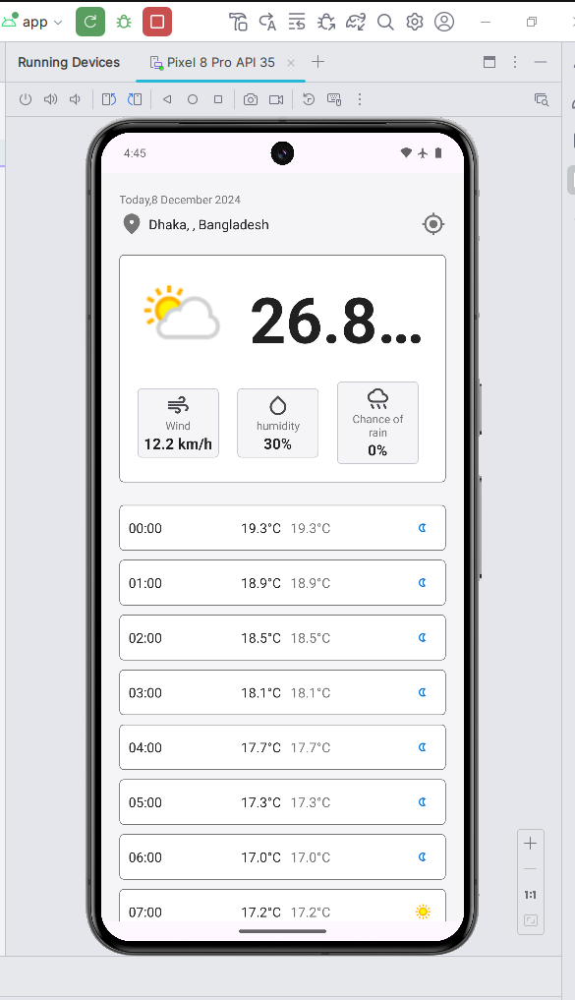
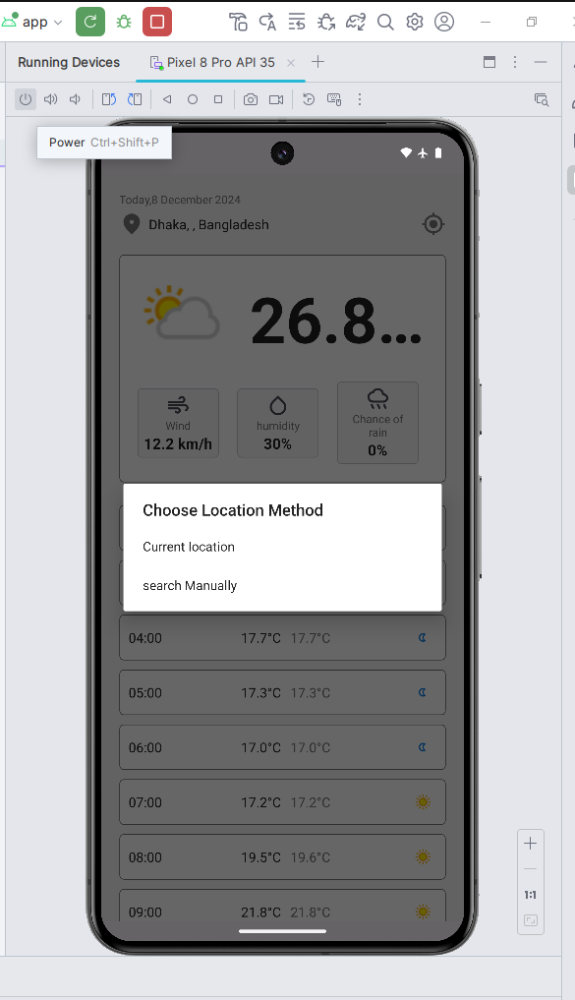
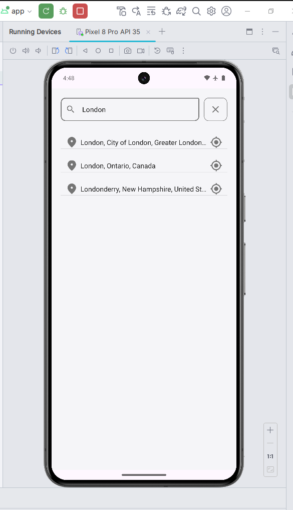
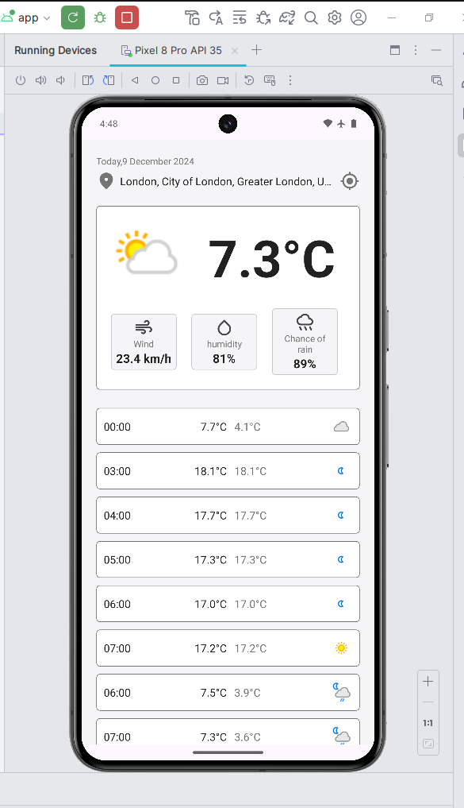

# Weather App 🌦️

This Weather App allows users to view weather data for their current location or manually search for a specific location.

## Features
- **Current Location Weather**: Automatically fetch weather data based on the user's current location.
- **Manual Search**: Search for weather in any city by typing its name.
- **Responsive Design**: Adapts to various screen sizes.
## Screenshots
### Home Screen

### Choose Location

### Manual Search

### Weather Data Display

## Technologies Used
- **Language**: Kotlin
- **UI Design**: XML
- **APIs**: [Free Weather API](https://www.weatherapi.com/) or any other service
- **Architecture**: MVVM
